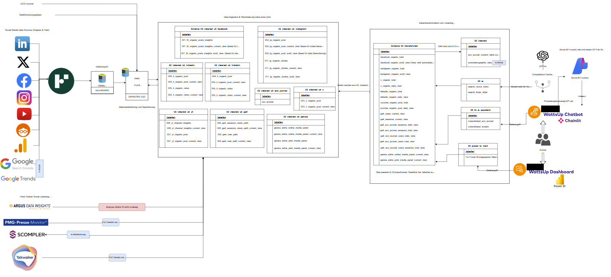

# Project DaTIF

### Architecture of the Data Platform

This repository is meant as an exemplary repository to fork before starting your own project. You have a fixed top-folder structure with generic yaml files in each subfolder to link to a pipeline. You might add folders, if you add ressources to your ressource group. For example, if you add azure functions to your ressource group, you might add a folder functions and start your development and deployment from there.

The development takes place from the dev branch. So you have to create a dev and a test branch from the main branch after forking this repository. If you have your dev branch you can start linking your resources to the subfolders.

The fixed folder structure is as follows:

### adf

use this folder to link to your Data Factory

- Manage --> Git configuration --> link this project and your repo with root folder = /adf and Collaboration Branch = dev

### notebooks

use this folder to clone to your Databricks Repositories

Official documentation to link Azure DevOps Repositories to Databricks
https://docs.microsoft.com/en-us/azure/databricks/repos/

### org

this folder contains the vars.yaml file, this file has to be modified before the pipelines can be executed

- zone: this variable determines the folder in the Databricks Workspace to move the notebooks to
- rg: the suffix of your ressource group - the name of your division
- nb_dir: the directory of your notebooks, should stay the same
- fct_dir: the directory of your custom functions, should also stay the same
- version: leave this variable empty
- adf_parameter: all parameters that have to be overwritten while deploying the Data Factory ARMTemplate. You can find your parameters in the ARMTemplateParametersForFactory file in the adf_publish branch. The keyvault parameter and the environment parameter are overwritten in the deployment yaml file. All other parameters have to be added here and have to be parameterised for the ressource group and the environment. For example if you have a blob trigger you have to parameterize the ressource group and the blob name. You have to add the variable triggerrg into the parameter. This variable will be defined in the deployment yaml. It will just take your ressource group name and remove the hyphen if there are any, because the storage name is without the hyphen (i.e. c-tife --> ctife)

example: Test_Trigger_properties_typeProperties_scope "/subscriptions/09b456a2-cf43-4d74-be5c-7d892d87207b/resourceGroups/datif-$(rg)-$(env)-rg/providers/Microsoft.Storage/storageAccounts/datif$(triggerrg)$(env)stdfs"

you can ignore the pictures subfolder, this is only meant for the pictures linked to this README.md.

### pyspark_functions

use this folder to build your own functions

- use the existing setup.py file and modify the arguments
- remember to use \_\_init\_\_.py files in subfolders

## Deployment

Create a test and a dev branch from your main branch to activate deployment to the respective ressource groups.
The yaml file will trigger on all changes in the respective subfolders and merge them to the dev, test, prod environment.

To start the deployment, you have to link the yaml files from the dev branch to a new pipeline
In DevOps navigate to Pipelines in the left panel.

Choose New pipeline --> Azure Repos Git --> Choose your Repo --> Existing Azure Pipelines YAML file

make sure that all necessary secrets are stored in your Key Vault. The secrets are defined in the readme files in the subfolders.

Read the adf/README.md for deployment of the Data Factory.
