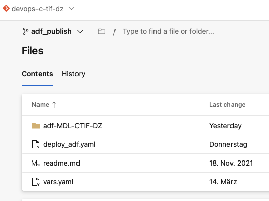

# Data Factory

Use this folder to connect to your Data-Factory. The picture in the main README.md shows the connection.
All subfolders will be generated automatically by the Data Factory. It will also create the adf_publish branch from which deployment will take place.
Dev is the collaboration branch which means that you can only publish from your dev branch. Every publish will update the adf_publish branch.

## Deployment 
The deployment will be triggered by all changes that occur in the test and main branch in the /adf subfolder. 
The deployment pipeline will checkout the adf_publish branch and take the ARMTemplates to deploy them to the environments.

